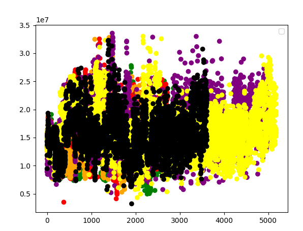
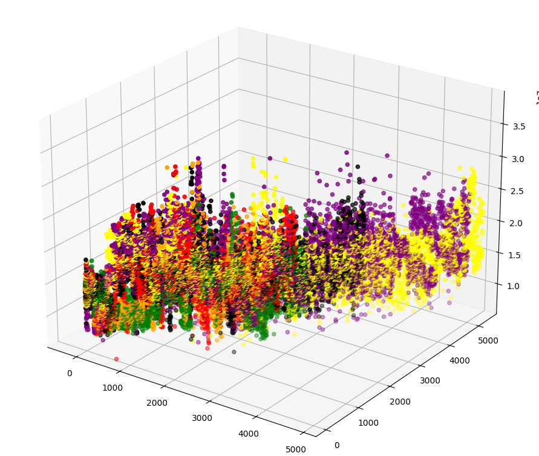

# yolo_datapoint

---

# Run

---

```bash
pip install -r requirements.txt
```

```bash
cd src
py main.py ../datasetPath/train.txt
```

#### Make sure you have a yolo v1 dataset with a train.txt file sending to all images

# Examples

---

## Visualise your data in 2D graph

- x-axis is the number of objects in the image
- y axis is the sum of the tensor
- colors are the tags of the objects (it display in the console)



## Visualise your data in 3D graph

